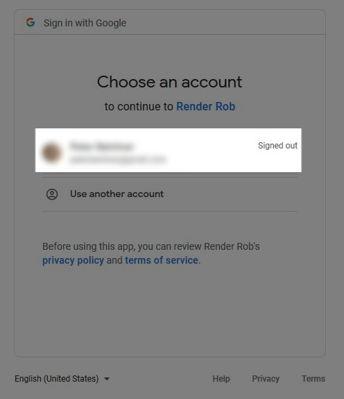
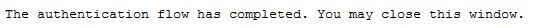
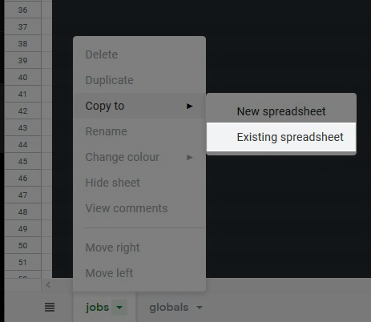
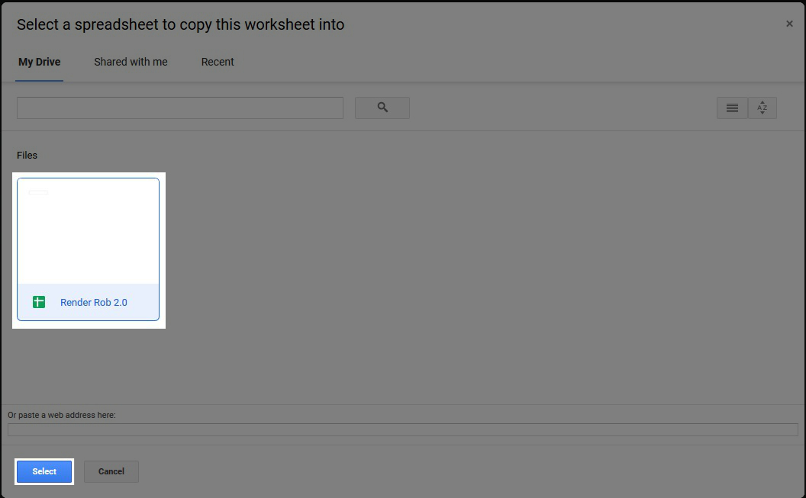
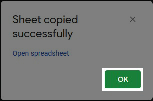
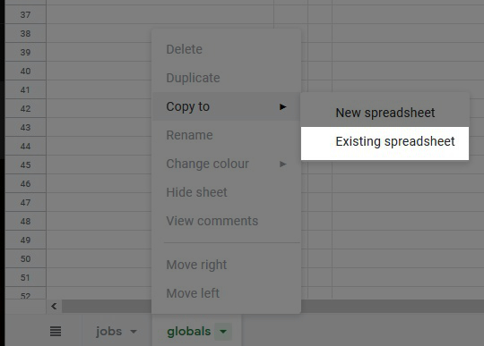

# Documentation

## Setup

Click on the chapter to open it:

<!-- ### Filling the spreadsheet -->

<b><u>1. Setting up the spreadsheet</u></b> 

1. Start Render Rob. This will open a login screen in your browser.

2. Select a Google account to proceed

3. Grant Render Rob the permission to view and manage the files it created. (It won't have any access to your files!)

Confirm your choices.

Close the browser tab, if this is shown:

6. Now go to the newly opened browser tab with the Render Rob template sheet. Copy both sheets to the new file, that has been just created in the background.

The new file should show up on the left, since it's the newest one.

Click OK

Copy the second sheet.

Select the sheet again.

Click OK again.

Then click enter in the Render Rob terminal to continue.

<b><u>2. Filling the spreadsheet</u></b>

After setting that up, fill in the global settings in the Sheet. The Blender Path and Render Path is mandatory, the rest is optional.

Now you only have to paste your attributes of your job to be rendered, and run `renderrob.exe`!

## Good to know

### Usage

- If you want to abort all renders, you have to close all three command-line windows.
- To stop the jobs, first close the Render Rob main window.
- The reason motion blur is in Render Rob, is that if you get motion blur artifacts, you can easily re-render those frames without motion blur
- You can run your own Python commands by adding them to the file `rr_user_comands.py` located in the folder `user`.

### Sheet

- Column a is a help for being able to select cells easier.
- Column t is necessary. Please do not delete it.
- For better overview, usually all settings in the sheet are checked (apart from the last one, denoising).
- If you disable Cycles (and by that enable Eevee), the irrelevant settings get disabled.
- Separate View Layers and add-ons with a comma (space is optional)
- If you want to render a still image, fill start frame with the frame you want to render and leave end frame blank.
- If you don't provide start frame and end frame the, Render Rob will render an animation with the start and end set in the Blender file.
- If you want to change the sheet you are using, insert the ID of the sheet in the `sheetcache`. You can see the ID for example in the link of the sheet.
- If you want to use a new sheet, just backup and delete the `sheetcache` file, and the setup process will start the next time you launch Render Rob.
- If you only want to denoise your shot, deactivate both CPU and GPU and activate Animation Denoising.
- If you're wondering, why you have to copy this sheet yourself, the reason is, that Render Rob respects your privacy and therefore does not have access to your spreadsheets, but only to the one it created. So you have to manually copy the sheet there.

### Render output

- If read only is enabled, a new folder with a new version number is created and used as render output.
- The Folder and frame name consists of `filename-camera-Scene-viewlayer-quality-version`
- Empty folders of failed renders get deleted in the end
- Render Rob never overwrites images. If you activate `new version`, he creates a new folder for output. If new version is not activated, he continues in the folder with the highest version number and skips already rendered images. So if you want to re-render some images, delete them, and then render the job with `new version` deactivated.

### Rendering

- Border rendering gets disabled, if high quality is active. Otherwise it remains enabled.
- Random seed is enabled, if Animation Denoising is enabled.
- Jobs get rendered in the order, they are shown in the list. You can reorder them by drag-and-drop. Therefore select the line and drag it on the left side up or down.
- CPU renders on n-1 cores to not bottleneck GPU render
- You can only render one scene in one job. If you want to render a second scene just create another job
- If no Scene is given, Render Rob renders the last active Scene.
- If no View Layer is given, Render Rob renders every View Layer.
- If Animation Denoising is activated, compositing is deactivated.

### Errors

- If Render Rob cannot find the sheet, maybe it's not shared with the API mail address.
- If you experience other errors, don't hesitate do drop me a message!

## Warnings in the sheet

If a property in the sheet gets marked yellow, this means, that a possible error is found. These are just warnings, so you still are able to start the job. In some cases it will work, in some it won't.

Following things are the most important ones being looked at:

- Double occurrences of jobs
- No render device selected
- High quality animation, but no Animation Denoising
- Animation Denoising, but exr is not selected
- Single frame rendering (start and end frame have the same value), but Animation Denoising is activated
- Single frame in high quality is being rendered, but Denoising is deactivated
- Single frame being rendered, but both CPU and GPU are selected

## Properties

Property list of the spreadsheet

| Property | Mandatory |Usage |
|--- |:---|:---|
| active | ✅ | Activates or deactivates job |
| .blend file path | ✅ | Absolute path to blend file, or relative path to the "path to blender files folder" given under globals |
| camera | | Name of camera to be activated, optional |
| start frame | | First frame to be rendered. It is recommended to give this information, so Render Rob can check if all the frames are rendered|
| end frame | | Last frame to be rendered. It is recommended to give this information, so Render Rob can check if all the frames are rendered|
| X res | | Horizontal resolution |
| Y res | | Vertical resolution|
| samples | | Number of Cycles or Eevee passes|
| file format | ✅ | Output file format. Exr refers to multilayer exr|
| Cycles (Eevee) | ✅ | If activated, Cycles is used, otherwise Eevee|
| CPU | ✅ | Usage of CPU for rendering |
| GPU | ✅ | Usage of GPU for rendering |
| motion blur | ✅ | Usage of Motion blur |
| new version | ✅ | If activated, a new folder gets created. Otherwise the job gets  |
| high-quality | ✅ | If deactivated, preview settings from globals are used|
| animation denoise | ✅ | Usage of post-process animation denoising|
| denoise | ✅ | Usage of image-denoising|
| scene | | Add name of scene to render. Only one is allowed here. Optional.|
| view layer | | Add name of view layer to render. Only one is allowed here. Optional.|
| comments | | Put your own comments of the shot here|
