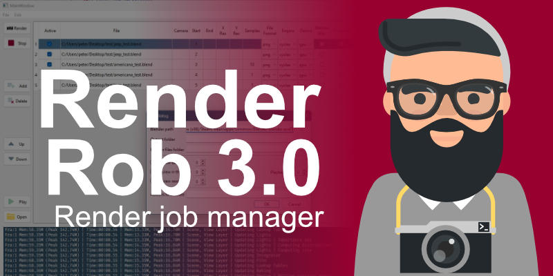
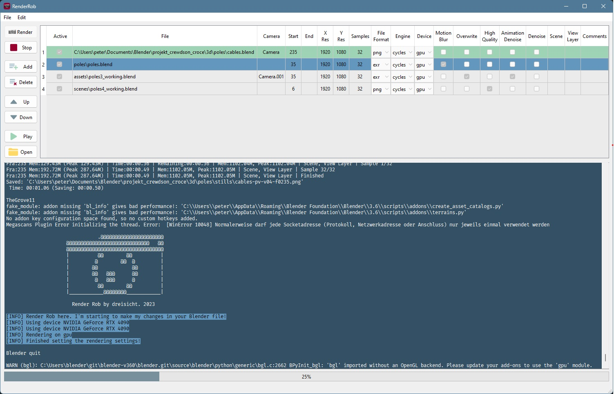

# Render Rob



**Render Rob is a Google Spreadsheet based Render manager for Blender. It gives you the possibility to easily manage your render jobs and change the settings from the sheet itself for better overview. No need for command line fiddling anymore!**

## Why should I use it?

Save time managing your render jobs!

## Who is it for?

Individuals and small teams.

## Features

- Overview of jobs and settings in a table
- You can render a quick preview, before spending hours on your final render
- Only one click needed to start rendering your jobs
- Usable for remote rendering too, since your UI is the sheet
- Warnings for implausible render settings directly in the sheet
- Automatic organizing of render output folder
- Cross plattform compatible



## Support

If you like the product and would like to support me, consider buying it on [Gumroad](https://gum.co/JXBgO) or [Blendermarket](https://blendermarket.com). Thanks a lot!

Render Rob is developed by the biggest effort possible, and every effort has been made that no harm should happen to you computer and files. Still Render Rob is not responsible for any harm and lost images. By downloading this product you consent this.

## Good to know

### Render output

- If read only is enabled, a new folder with a new version number is created and used as render output.
- The Folder and frame name consists of `filename-camera-Scene-viewlayer-quality-version`
- Empty folders of failed renders get deleted in the end
- Render Rob never overwrites images. If you deactivate `overwrite`, he creates a new folder for output. If new version is not activated, he continues in the folder with the highest version number and skips already rendered images. So if you want to re-render some images, delete them, and then render the job with `overwrite` activated.

### Rendering

- Border rendering gets disabled, if high quality is active. Otherwise it remains enabled.
- Random seed is enabled, if Animation Denoising is enabled.
- Jobs get rendered in the order, they are shown in the list. You can reorder them by drag-and-drop. Therefore select the line and drag it on the left side up or down.
- CPU renders on n-1 cores to not bottleneck GPU render
- You can only render one scene in one job. If you want to render a second scene just create another job
- If no Scene is given, Render Rob renders the last active Scene.
- If no View Layer is given, Render Rob renders every View Layer.
- If Animation Denoising is activated, compositing is deactivated.

## Warnings in the sheet

If a property in the sheet gets marked yellow, this means, that a possible error is found. These are just warnings, so you still are able to start the job. In some cases it will work, in some it won't.

Following things are the most important ones being looked at:

- Double occurrences of jobs
- High quality animation, but no Animation Denoising
- Animation Denoising, but exr is not selected
- Single frame rendering (start and end frame have the same value), but Animation Denoising is activated
- Single frame in high quality is being rendered, but Denoising is deactivated

## Developer area

Install QtDesigner:

```
pyqt6-tools installuic
```

Start QtDesigner:

```
pyqt6-tools designer
```

Convert protos:

```
protoc --proto_path=proto/ --python_out=proto/ proto/state.proto
protoc --proto_path=proto/ --python_out=proto/ proto/cache.proto
```

Create .ico file

```
magick.exe convert icon-16.png icon-20.png icon-24.png icon-32.png icon-40.png icon-48.png icon-64.png icon-256.png icon.ico 
```

Deploy

```
pyside6-deploy .\main_window.pyw --name RenderRob
```
