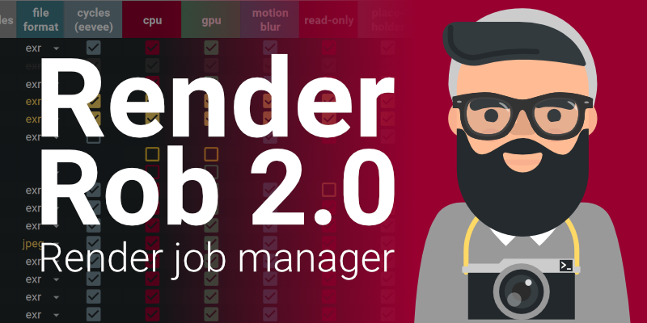

# Render Rob

**Render Rob is a Google Spreadsheet based Render manager for Blender. It gives you the possibility to easily manage your render jobs and change the settings from the sheet itself for better overview. No need for command line fiddling anymore!**

## Why should I use it?

Save time managing your render jobs!

## Who is it for?

Individuals and small teams.

## Features

- Overview of jobs and settings in a table
- You can render a quick preview, before spending hours on your final render
- Only one click needed to start rendering your jobs
- Usable for remote rendering too, since your UI is the sheet
- Warnings for implausible render settings directly in the sheet
- Automatic organizing of render output folder
- Automatic start of CPU and GPU jobs, so that all devices are always at full load
- Built for both Windows and Linux

## Requirements

- Google account
- 2 minutes of time for setup
- Blender

## Support

If you like the product and would like to support me, consider buying it on [Gumroad](https://gum.co/JXBgO) or [Blendermarket](https://blendermarket.com). Thanks a lot!

Render Rob is developed by the biggest effort possible, and every effort has been made that no harm should happen to you computer and files. Still Render Rob is not responsible for any harm and lost images. By downloading this product you consent this.
