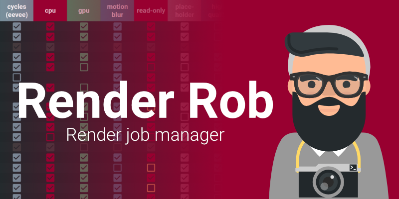
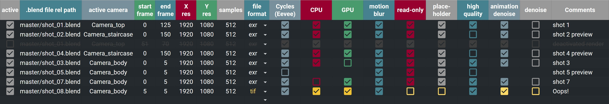

# Render Rob

**Render Rob is a Google Spreadsheet based Render manager for Blender. It gives you the possibility to easily manage your render jobs and change the settings from the sheet itself for better overview. No need for command line fiddling anymore!**

## Why should I use it?

Save time settings up your renders
You can render a quick preview, before spending hours on your final render

## Who ist it for?

## Usage

Press ctrl + c in the main window to stop the batch rendering. Closing the blender windows itself only cancels current job!

## Features

- Overview of jobs and settings in a table
- Only one click needed to start rendering your jobs
- Usable for remote rendering too, since your UI is the sheet
- Warnings for implausible render settings directly in the sheet
- Automatic organizing of render output folder
- Automatic start of CPU and GPU jobs, so that all devices are allways at full load
<!-- screenshot!! TODO -->

## Requirements

- Google account
- 15 minutes of time for setup
- Blender

## Properties

Property list of the spreadsheet

| Property | Usage |
|--- |:---|
| active | Activates or deactivates job |
| .blend file path | Path of blend file. Absolute path, as well as relative path to file folder in globals is possible |
| camera | Name of camera to be activated, optional |
| start frame | First frame to be rendered|
| end frame | Last frame to be rendered|
| X res | Horizontal resolution |
| Y res | Vertical resolution|
| samples | Number of Cycles or Eevee passes|
| file format | Output file format. Exr refers to multilayer exr|
| Cycles (Eevee) | If activated, Cycles is used, otherwise Eevee|
| CPU | Usage of CPU for rendering |
| GPU | Usage of GPU for rendering |
| motion blur | Usage of Motion blur |
| read only | If activated, already rendered images don't get overwritten |
| place-holder | Creating placeholders of images being rendered |
| high-quality | If deactivated, preview settings from globals are used|
| animation denoise | Usage of post-process animation denoising|
| denoise | Usage of image-denoising|
| scene | Add name of scene to render. Only one is allowed here. Optional.|
| view layer | Add name of view layer to render. Only one is allowed here. Optional.|
| comments | Put your own comments of the shot here|

## Further explanations

- If you want to abort all renders, you have to close all three command-line windows.
- The reason motion blur is in Render Rob, is that if you get motion blur artifacts, you can easily re-render those frames without motion blur
- Column t is necessary. Please do not delete it.
- Column a is a help for being able to select cells easier.
- If read only is enabled, a new folder with a new version number is created and used as render output.
- Jobs get rendered in the order, they are shown in the list. You can reorder them by drag-and-drop. Therefore select the line and drag it on the left side up or down.
- Border rendering gets disabled, if high quality is active. Otherwise it remains enabled.
- Currently the rendering of multiple scenes and view layers is not supported. You will get a warning and it will only render the first scene and the first view layer. If you need this functionality please open an issue and I will look what I can do.
- You can put your own blender commands in the file called `rr_user_commands.py`. An example for this is be the activation of an add-on.
- If you disable Cycles (and by that enable Eevee), the irrelevant settings get disabled.
- Standard settings for a render job is, that all checkboxes are activated apart from the last one. In this way it's easy to see what you're doing.
- If you want to render a still image, fill start and endframe with same value.
- CPU renders on n-1 cores to not bottleneck GPU render
- You can only render one scene in one job. If you want to render a second scene just create another job
- If no View Layer is given, Render Rob renders every View Layer.
- If no Scene is given, Render Rob renders every Scene.
- If Animation Denoising is activated, compositing is deactivated.
- Separate View Layers and addons with a comma
- If Render Rob cannot find the sheet, maybe it's not shared with the api mail adress.

## Warnings in the sheet

If a property in the sheet gets marked yellow, this means, that a possible error is found. These are just warnings, so you still are able to start the job. In some cases it will work, in some it won't.

Following things are being looked at:

- Double occurrences of jobs
- No render device selected
- Both devices active, but no read only
- Both devices active, but no placeholders
- High quality animation, but no animation denoising
- Animation denoising, but exr is not selected
- Single frame rendering (start and end frame have the same value), but animation denoising is activated
- Single frame in high quality is being rendered, but Denoising is deactivated
- Single frame being rendered, but both CPU and GPU are selected

## Setup

Click on the chapter to open it:

Setting up Google api

<!-- ### Setting up Google api -->

1. Open up https://console.developers.google.com, agree to terms and conditions and click on `Agree and continue`

2. Click on create project

3. Name the project e.g. Render Rob and click on create

4. Search for **Google Drive API** and enable it

<!--  -->

5. Same for **Google Sheets API**

6. Click on Create Credentials

7. fill out the form and click on `What credentials do I need?`

8. continue filling out

9. save the json file you get in the `Render Rob\Key` Folder

<!-- ### Spreadsheet -->

Spreadsheet setup 

1. Open this spreadsheet:
https://docs.google.com/spreadsheets/d/1WWVV_Iteum82jcmbp4dNShwJ-e1dlw42UG-UKvsKnwc

1. Copy the sheet into your Drive 

3. Name it `Render Rob`. Correct naming is important!

4. Copy the e-mail address from step 8 (it's called Service account ID there) and share the sheet with the mail!

<!-- ### Filling the spreadsheet -->

Filling the spreadsheet 

After setting that up, fill in the global settings in the Sheet. The Blender Path and Render Path is mandatory, the rest is optional.

Now you only have to paste your attributes of your job to be rendered, and run `renderrob.exe`!

## Support

If you like the product and would like to support me, consider buying it on [Gumroad](https://gum.co/JXBgO) or [Blendermarket](https://blendermarket.com). Thanks a lot!
