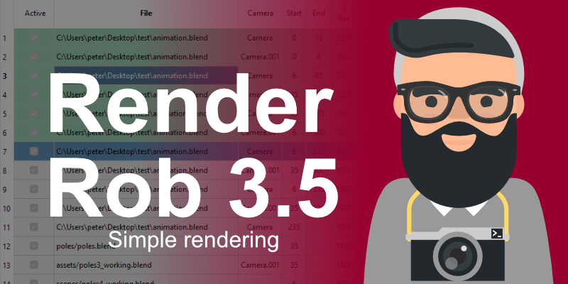
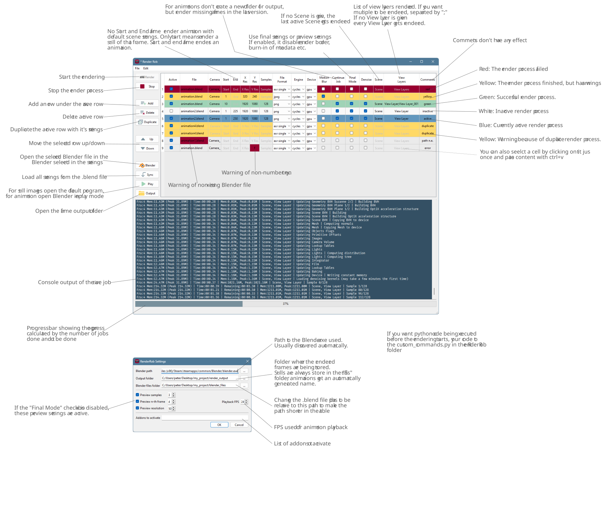

# Render Rob

[](https://github.com/dreisicht/renderrob/actions/workflows/test.yaml)



**Render Rob is a standalone Render Manager built with the goal to make rendering multiple Blender files as easy as possible. No need for command line fiddling anymore!**

## Why should I use it?

Save time managing your render jobs!

## Who is it for?

Individuals and small teams, who don't want to render with a render farm, but still want to manage their render jobs in a simple way.

## Features

- Overview of jobs and settings in a table.
- You can render a quick preview, before spending hours on your final render.
- Only one click needed to start rendering your jobs.
- Warnings for implausible render settings directly in the table.
- Automatic organizing of render output folder.
- Cross platform compatible.



<!-- <video width="100%" controls>
  <source src="https://dreisicht.net/video/renderrob_v3.mp4" type="video/mp4">
Your browser does not support the video tag.
</video> -->

## Support

If you like the product and would like to support me, consider buying it on [Gumroad](https://gum.co/JXBgO) or [Blendermarket](https://blendermarket.com/products/render-rob). Thanks a lot!

Render Rob is developed by the biggest effort possible, and every effort has been made that no harm should happen to you computer and files. Still Render Rob is not responsible for any harm and lost images. By downloading this product you consent to this.

## Good to know

### Render output

- If you want to render a still, enter a frame number.
- For rendering an animation enter both start and end frame, or leave the start and end frame empty.
- If read only is enabled, a new folder with a new version number is created and used as render output.
- The Folder and frame name consists of `filename-camera-Scene-viewlayer-quality-version`
- Empty folders of failed renders get cleaned up.
<!-- TODO: Verify this. -->
- Render Rob never overwrites images. If you deactivate `overwrite`, it creates a new folder for output. If new version is not activated, it continues in the folder with the highest version number and skips already rendered images. So if you want to re-render some images, delete them, and then render the job with `overwrite` activated.

### Rendering

- Border rendering gets disabled, if high quality is active. Otherwise it remains enabled.
- You can only render one scene in one job. If you want to render a second scene just duplicate the job.

## Developer area

Python version required due to bpy: **3.13**

Set up the environment:

```
uv sync --group dev
```

Convert protos (needed once before the first run; protoc comes from the dev group,
so no system install is required):

```
sh src/protos/build_proto.sh
```

Run the app (from `src`, because it resolves `icon/` and `ui/` against the working
directory):

```
cd src && uv run python main.py
```

Run the tests, the linter and the type checker:

```
cd src && QT_QPA_PLATFORM=offscreen uv run python -m unittest discover -s . -p '*_test.py'
uv run ruff check .
uv run ruff format --check .
uv run ty check
```

`ty check` needs the generated proto stubs, so run `sh src/protos/build_proto.sh` first.

Install QtDesigner:

```
pyqt6-tools installuic
```

Start QtDesigner:

```
pyqt6-tools designer
```

Create .ico file

```
magick.exe convert icon-16.png icon-20.png icon-24.png icon-32.png icon-40.png icon-48.png icon-64.png icon-256.png icon.ico
```

Remove stale origin branches

```
git remote prune origin
```

### Building

Build, sign, notarize and package the Mac app:

```
sh tools/build_mac.sh
```

Build the downloadable bundles the way CI does, for the platform you are on:

```
uv sync --group build
uv run pyinstaller --noconfirm --clean tools/renderrob.spec
```

That leaves a `dist/renderrob/` directory on Linux and Windows, and a
`dist/RenderRob.app` on macOS.

Publishing a GitHub release runs the same build on Linux, macOS and Windows
(`.github/workflows/release.yaml`) and attaches the three archives to it. The
workflow can also be started by hand from the Actions tab, which builds and
smoke-tests the bundles and leaves them as run artifacts instead.

Two things the CI bundles are not:

- **Not signed or notarized.** macOS puts a quarantine flag on anything
  downloaded from a browser and refuses to open it with "RenderRob is damaged
  and can't be opened", so the archive has to be cleared first:
  `xattr -dr com.apple.quarantine /Applications/RenderRob.app`. The signed and
  notarized Mac release still comes from `tools/build_mac.sh` locally, which
  needs the signing key.
- **Not universal on macOS.** The published `.app` is arm64 only. There is a
  commented-out `macos-15-intel` entry in the workflow matrix for an Intel
  build.

Note that the `tools/pysidedeploy_*.spec` files are stale: they point at
`renderrob.py`, which is now `src/main.py`, and hardcode local Python 3.10/3.11
interpreter paths.

Debugging a notarization run:

```
xcrun notarytool log <request UUID> --keychain-profile "dev"
```

# TODOs:
Buttons on mac weird.
