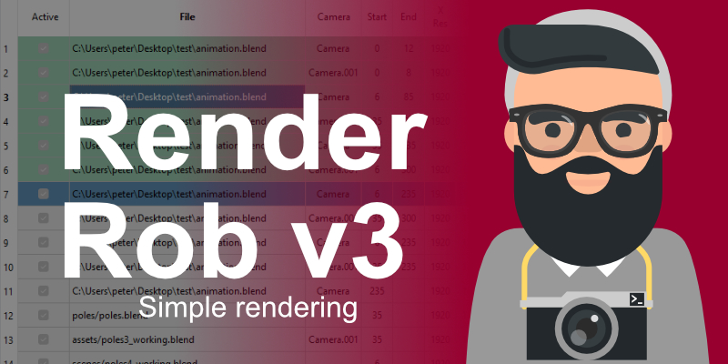

# Render Rob

[](https://github.com/dreisicht/renderrob/actions/workflows/linux_test_and_build.yaml)
[](https://github.com/dreisicht/renderrob/actions/workflows/windows_mac_build.yaml)



**Render Rob is a standalone Render Manager built with the goal to make rendering multiple Blender files as easy as possible. No need for command line fiddling anymore!**

## Why should I use it?

Save time managing your render jobs!

## Who is it for?

Individuals and small teams.

## Features

- Overview of jobs and settings in a table.
- You can render a quick preview, before spending hours on your final render.
- Only one click needed to start rendering your jobs.
- Warnings for implausible render settings directly in the table.
- Automatic organizing of render output folder.
- Cross plattform compatible.


## Support

If you like the product and would like to support me, consider buying it on [Gumroad](https://gum.co/JXBgO) or [Blendermarket](https://blendermarket.com). Thanks a lot!

Render Rob is developed by the biggest effort possible, and every effort has been made that no harm should happen to you computer and files. Still Render Rob is not responsible for any harm and lost images. By downloading this product you consent to this.

## Good to know

### Render output

- If you want to render a still, you can either leave the start and end frame empty. If you want to
render a specific frame as a still, enter a number in the start frame field, but leave the end frame empty.
- For rendering an animation enter both start and end frame.
- If read only is enabled, a new folder with a new version number is created and used as render output.
- The Folder and frame name consists of `filename-camera-Scene-viewlayer-quality-version`
- Empty folders of failed renders get cleaned up.
<!-- TODO: Verify this. -->
- Render Rob never overwrites images. If you deactivate `overwrite`, it creates a new folder for output. If new version is not activated, it continues in the folder with the highest version number and skips already rendered images. So if you want to re-render some images, delete them, and then render the job with `overwrite` activated.

### Rendering

- Border rendering gets disabled, if high quality is active. Otherwise it remains enabled.
- Random seed is enabled, if Animation Denoising is enabled.
- Jobs get rendered in the order, they are shown in the list. You can reorder them with the up and down buttons.
- You can only render one scene in one job. If you want to render a second scene just duplicate the job.
- If no Scene is given, Render Rob renders the last active Scene.
- If no View Layer is given, Render Rob renders every View Layer.
- If Animation Denoising is activated, compositing is deactivated.

## Developer area

Install QtDesigner:

```
pyqt6-tools installuic
```

Start QtDesigner:

```
pyqt6-tools designer
```

Convert protos:

```
protoc --proto_path=proto/ --python_out=proto/ proto/state.proto
protoc --proto_path=proto/ --python_out=proto/ proto/cache.proto
```

Create .ico file

```
magick.exe convert icon-16.png icon-20.png icon-24.png icon-32.png icon-40.png icon-48.png icon-64.png icon-256.png icon.ico 
```

Deploy

```
.\venv\Scripts\activate
pyside6-deploy -c .\pysidedeploy.spec
```
